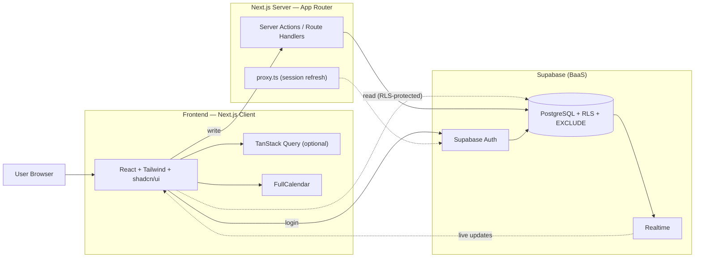
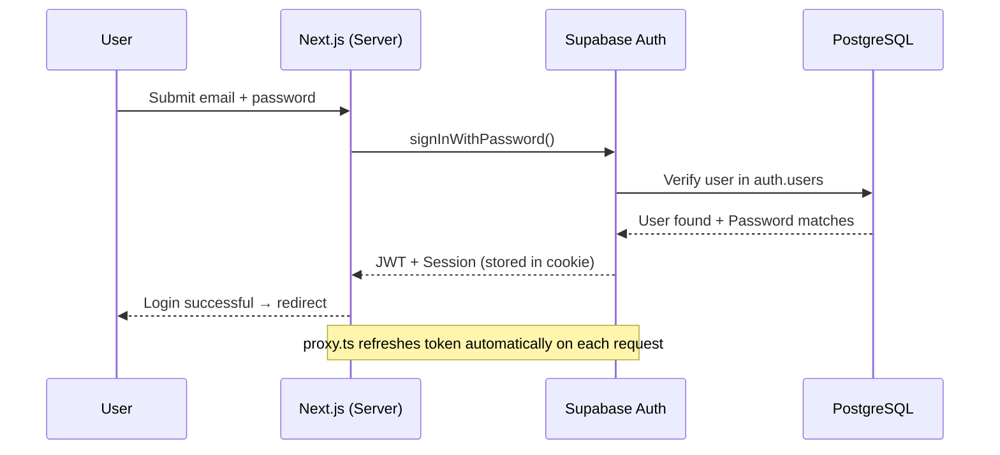
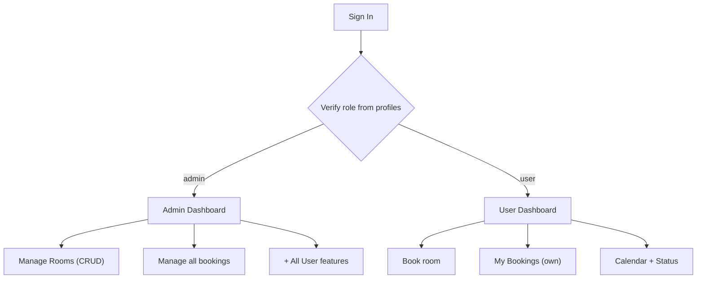
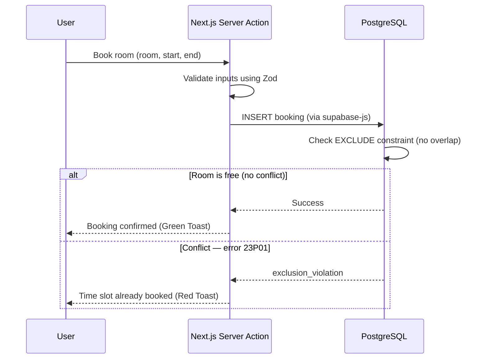
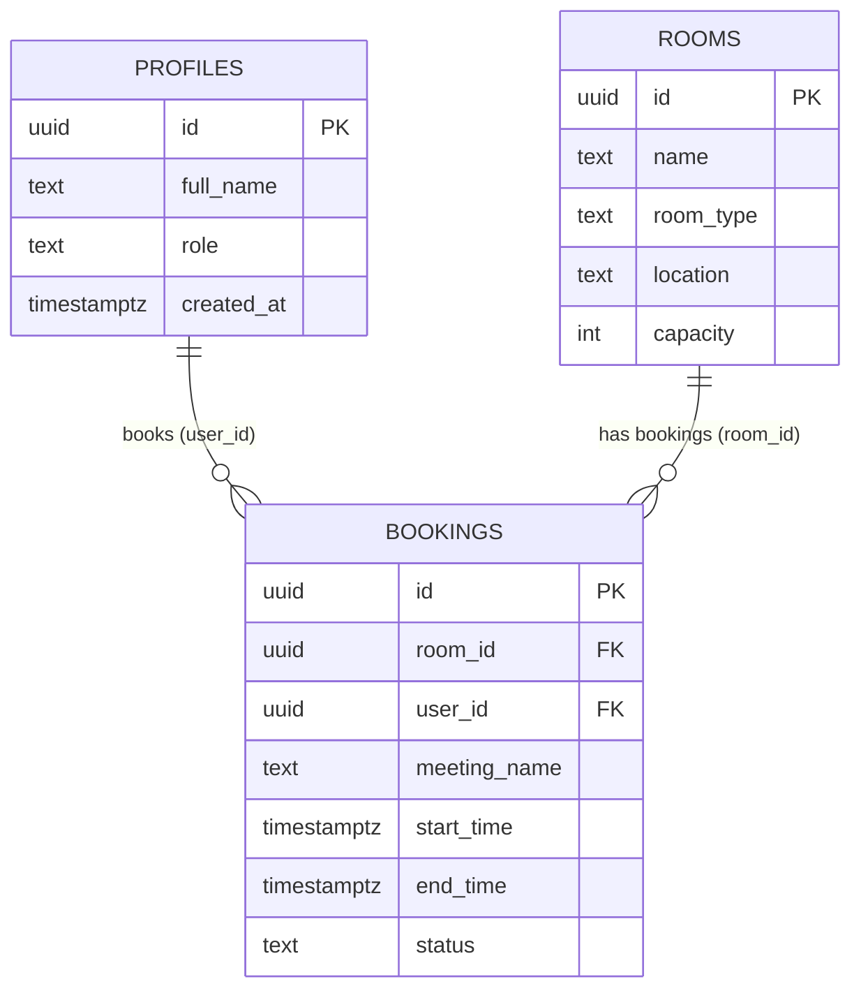
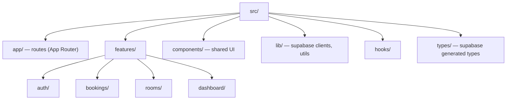
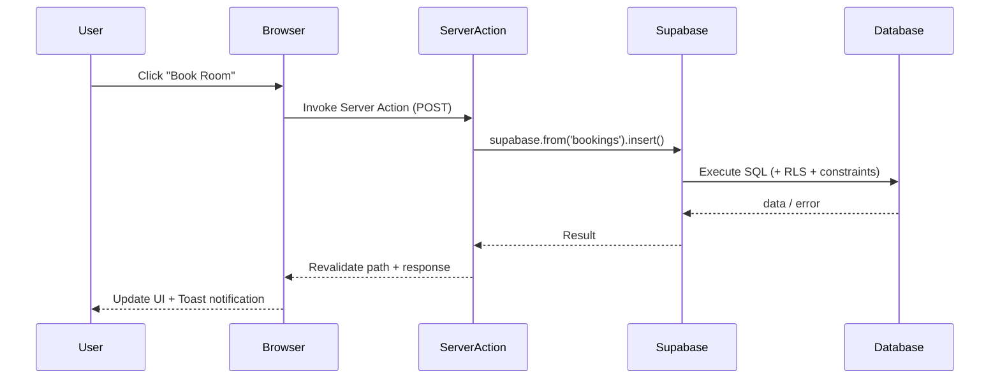
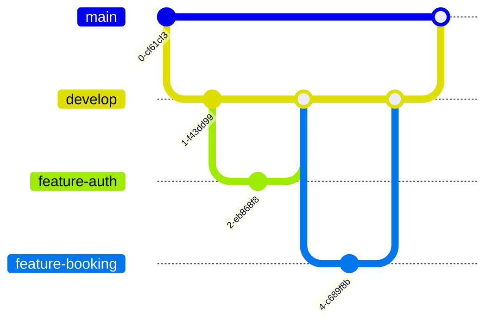
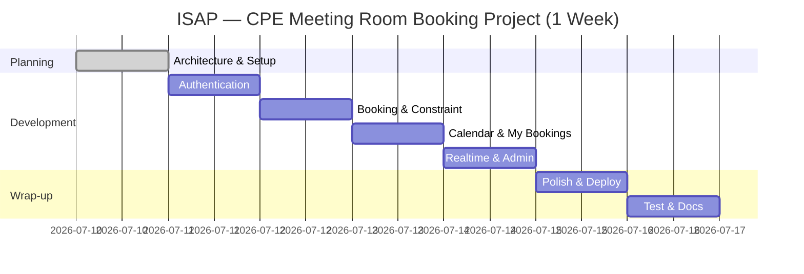

# Architecture — CPE Meeting Room Booking System (ISAP)

This document describes the system design using **Mermaid diagrams** (automatically rendered by GitHub when viewing `docs/architecture.md`). It serves as both architectural documentation and a script to explain the system during evaluations.

**Mapping to Grading Rubric:**
* §1 → Architecture & Tech Stack
* §2–3 → Authentication & Authorization
* §4,7 → Code Explanation & Flow
* §5 → Database design
* §6 → Code Quality
* §8 → Version Control
* §9 → Project Management

---

## 1. Overall System Architecture

**Design Rationale:**
Next.js acts as both frontend and backend (via Server Actions), eliminating the need for a separate API server. Supabase, as a Backend-as-a-Service, integrates Auth, PostgreSQL, and Realtime capabilities.
A key aspect of this design is the **separation of read and write paths**:
* **Read path (calendar views, room status):** The client reads from Supabase directly, secured by **Row Level Security (RLS)** policies at the database layer.
* **Write path (creating/cancelling bookings):** Requests go through **Server Actions** to validate data and handle business logic securely.

---

## 2. Authentication Flow

**Session Management:**
Upon successful login, Supabase Auth issues a **JWT** (JSON Web Token) signed with the project's secret. This JWT is stored in cookies via `@supabase/ssr`. For subsequent requests, this JWT is automatically attached to Supabase client operations, allowing **RLS** to identify the user via `auth.uid()`.
`proxy.ts` (Next.js middleware) automatically handles refreshing the session token because Server Components cannot set cookies directly.

---

## 3. Authorization (Role-based)

**Privilege Differences:**
After login, the system reads the user's `role` (`user` or `admin`) from the `profiles` table.
Access control is enforced **at the database level via RLS policies**, not just hidden in the UI:
* For `bookings`, a standard user can only insert, update, or delete rows where `user_id` matches their own ID (`auth.uid() = user_id`).
* An admin (verified via the `is_admin()` SQL function) has full write privileges on all rows.
This architecture secures the system from unauthorized cross-privilege access even if client-side safety checks are bypassed.

---

## 4. Booking Flow (Conflict Prevention)

**Preventing Overlapping Bookings:**
Double-booking checks are enforced at the database level using an **EXCLUDE constraint** (btree_gist + `tstzrange`). This makes the operation **atomic**, preventing race conditions when multiple users attempt to book the same room at the same millisecond.
When a conflict occurs, PostgreSQL rejects the transaction with error code `23P01`. The Server Action catches this error via a `try/catch` block and returns a clear, user-friendly message.

---

## 5. Database ER Diagram

**Database Details:**
* `PROFILES.id` maps directly to Supabase's internal `auth.users.id`.
* `ROOMS.room_type` is constrained to `small | medium | large`.
* `BOOKINGS.status` is constrained to `booked | cancelled`.
* The relationship is one-to-many: one user can have multiple bookings, and one room can have multiple bookings.
* Exclude constraints are applied on the `BOOKINGS` table.

---

## 6. Directory Structure (Feature-based)

**Code Quality and Conventions:**
We use a **feature-based structure** where files belonging to the same feature (components, server actions, schemas, types) are grouped inside `src/features/<feature_name>/`.
This keeps the code modular, readable, and scalable.
* `lib/` houses the browser and server-side Supabase client initialization.
* `types/` holds TypeScript types generated from the Supabase schema to ensure system-wide type safety.

---

## 7. Request Lifecycle

**Lifecycle Description:**
Every database write operation must flow through a Next.js Server Action rather than direct browser inserts. The database layer executes the SQL operation while checking RLS policies and constraints, returning the result to the server, which then triggers a path revalidation to update the UI on the client.

---

## 8. Git Flow

**Branching Strategy:**
* `main` is kept stable at all times.
* `develop` is the integration branch for all completed features.
* Features are developed on separate `feature/<name>` branches.
* Commits follow the **Conventional Commits** standard (e.g. `feat:`, `fix:`, `refactor:`, `docs:`) to create a clear project history.

---

## 9. Project Timeline

**Timeline Details:**
The project is planned as a 7-day sprint: starting with architecture and setups, followed by Authentication, core Booking constraint checks, Calendar integration, Real-time status subscriptions, Admin utilities, and ending with UI polish, linting, deployment, and testing.
